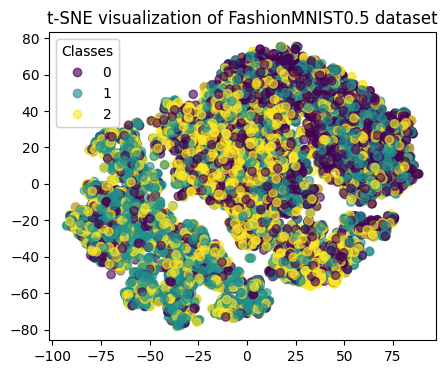

# Robust Trainers for Noisy Labels

## Introduction
This project is an experimental repository focusing on dealing with datasets containing a high level of noisy labels (50% and above). This repository features experiments conducted on the `FashionMNIST` and `CIFAR` datasets using the `ResNet34` as the baseline classifier.

The repository explores various training strategies (`trainers`), including `ForwardLossCorrection`, `CoTeaching`, `JoCoR`, and `O2UNet`. Specifically, for datasets with unknown transition matrices, `DualT` is employed as the Transition Matrix Estimator. Given the computational complexity and practical performance considerations, our experiments primarily focus on `ForwardLossCorrection` and `CoTeaching`. We conducted multiple experiments with different random seeds to compare these two methods.

Initial explorations on `FashionMNIST0.5` with `JoCoR` and `O2UNet` have shown promising results. This repository serves as a resource for those interested in robust machine learning techniques under challenging conditions of high label noise.

A brief pipeline: 

## Experimental Setup
- Datasets (3 classes: 0, 1, 2; instead of 10): 
    - FashionMNIST with Known Flip Rate
        - Noise Level: 0.5
        

            <h5>Transition Matrix of FashionMNIST0.5</h5>
            <table>
            <tr><td>0.5</td><td>0.2</td><td>0.3</td></tr>
            <tr><td>0.3</td><td>0.5</td><td>0.2</td></tr>
            <tr><td>0.2</td><td>0.3</td><td>0.5</td></tr>
            </table>
        

        
        

            
             
            Noisy Data
        

        

            
             
            Clean Data
        

        
        - Noise Level: 0.6
        

            <h5>Transition Matrix of FashionMNIST0.6</h5>
            <table>
            <tr><td>0.4</td><td>0.3</td><td>0.3</td></tr>
            <tr><td>0.3</td><td>0.4</td><td>0.3</td></tr>
            <tr><td>0.3</td><td>0.3</td><td>0.4</td></tr>
            </table>
        

        

            
             
            Samples in FashionMNIST0.6
        

    - CIFAR with Unknown Flip Rate
        

            
             
            Samples in CIFAR
        

- Base Classifier:
    - ResNet-34
    
- Basic Robust Method(s):
    - Data Augmentation

- Robust Trainers:
    - Loss correction: `ForwardLossCorrection`
        - Includes: `SymmetricCrossEntropyLoss`
    - Multi-network learning: `CoTeaching`
    - Multi-network learning: `JoCoR`
    - Multi-round learning: `O2UNet` 

- Transition Matrix Estimator:
    - `Dual-T`

## Results
### Loss value trends
According to the the loss trends, we find that our robust trainers may also act as regularizers to avoid overfitting.

- `ForwardLossCorrection`

    
     
    Loss Trend

-  `CoTeaching`

    
     
    Loss Trend

### Performance
We conduct experiments with 10 different random seeds on `ForwardLossCorrection` and `CoTeaching`. Here is their performance comparison.

<table>
    <h3>Peformance Comparison</h3>
    <thead>
        <tr>
            <th rowspan="2">Dataset</th>
            <th rowspan="2">Metrics</th>
            <th colspan="2">Robust Trainer</th>
        </tr>
        <tr>
            <th>ForwardLossCorrection</th>
            <th>CoTeaching</th>
        </tr>
    </thead>
    <tbody>
    <tr>
        <td rowspan="4">FashionMNIST0.5</td>
        <td>Accuracy</td>
        <td>77.47%(&plusmn; 6.33%)</td>
        <td>90.33%(&plusmn; 3.34%)</td>
    </tr>
    <tr>
        <td>Precision</td>
        <td>78.87%(&plusmn; 5.75%)</td>
        <td>90.93%(&plusmn; 2.49%)</td>
    </tr>
    <tr>
        <td>Recall</td>
        <td>77.47%(&plusmn; 6.33%)</td>
        <td>90.33%(&plusmn; 3.34%)</td>
    </tr>
    <tr>
        <td>F1 Score</td>
        <td>77.53%(&plusmn; 6.54%)</td>
        <td>90.29%(&plusmn; 3.46%)</td>
    </tr>
    <tr>
        <td rowspan="4">FashionMNIST0.6</td>
        <td>Accuracy</td>
        <td>77.05%(&plusmn; 6.61%)</td>
        <td>80.25%(&plusmn; 12.44%)</td>
    </tr>
    <tr>
        <td>Precision</td>
        <td>80.08%(&plusmn; 3.64%)</td>
        <td>75.28%(&plusmn; 20.81%)</td>
    </tr>
    <tr>
        <td>Recall</td>
        <td>77.05%(&plusmn; 6.61%)</td>
        <td>80.25%(&plusmn; 12.44%)</td>
    </tr>
    <tr>
        <td>F1 Score</td>
        <td>76.27%(&plusmn; 8.55%)</td>
        <td>76.92%(&plusmn; 17.83%)</td>
    </tr>
    <tr>
        <td rowspan="4">CIFAR</td>
        <td>Accuracy</td>
        <td>49.81%(&plusmn; 12.58%)</td>
        <td>47.28%(&plusmn; 4.09%)</td>
    </tr>
    <tr>
        <td>Precision</td>
        <td>50.11%(&plusmn; 12.06%)</td>
        <td>33.41%(&plusmn; 3.73%)</td>
    </tr>
    <tr>
        <td>Recall</td>
        <td>49.81%(&plusmn; 12.58%)</td>
        <td>47.28%(&plusmn; 4.09%)</td>
    </tr>
    <tr>
        <td>F1 Score</td>
        <td>49.09%(&plusmn; 12.27%)</td>
        <td>38.04%(&plusmn; 3.69%)</td>
    </tr>
    </table>

Obviously, when the noise level is low, `CoTeaching` works better, while when the noise level increases `ForwardLossCorrection` will be more robust compared to `CoTeaching`.

In our initial experiments, both `JoCoR` and `O2UNet` work well on `FashionMNIST0.5`. However, given computational complexities and insignificant improvements compared to `CoTeaching`, we did not conduct full experiments on them

### Estimation of Transition Matrix
- Estimation on FashionMNIST05

    <h5>Estimated Transition Matrix of FashionMNIST0.5</h5>
    <table>
    <tr><td>0.473</td><td>0.209</td><td>0.309</td></tr>
    <tr><td>0.306</td><td>0.485</td><td>0.232</td></tr>
    <tr><td>0.221</td><td>0.306</td><td>0.460</td></tr>
    </table>

- Estimation on FashoinMNIST06

    <h5>Estimated Transition Matrix of FashionMNIST0.6</h5>
    <table>
    <tr><td>0.407</td><td>0.295</td><td>0.298</td></tr>
    <tr><td>0.297</td><td>0.394</td><td>0.308</td></tr>
    <tr><td>0.301</td><td>0.310</td><td>0.388</td></tr>
    </table>

- Estimation on CIFAR

    <h5>Estimated Transition Matrix of CIFAR</h5>
    <table>
    <tr><td>0.365</td><td>0.332</td><td>0.311</td></tr>
    <tr><td>0.337</td><td>0.368</td><td>0.315</td></tr>
    <tr><td>0.298</td><td>0.300</td><td>0.374</td></tr>
    </table>

